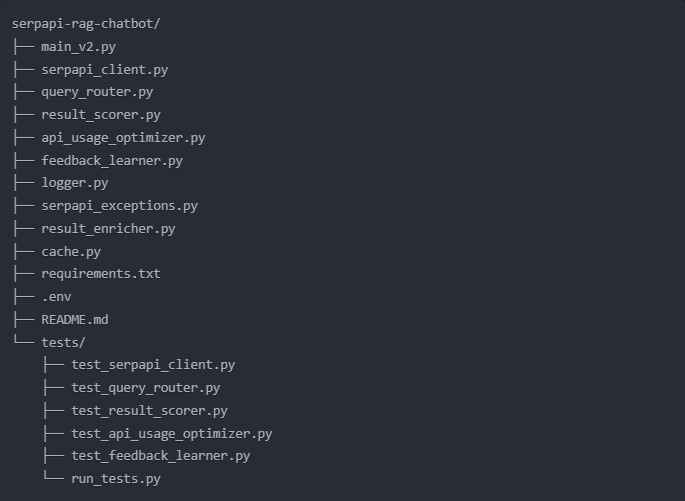

# OmniQuery v2.0


This project integrates SerpAPI into a Retrieval-Augmented Generation (RAG) chatbot system, combining results from Pinecone, You.com, and SerpAPI to provide comprehensive and up-to-date information. The chatbot uses advanced natural language processing techniques to understand user queries, retrieve relevant information from multiple sources, and generate human-like responses.

## Table of Contents

1. [Features](#features)
2. [Installation](#installation)
3. [Usage](#usage)
4. [Configuration](#configuration)
5. [Architecture](#architecture)
6. [API Reference](#api-reference)
7. [Logging](#logging)
8. [Best Practices](#best-practices)
9. [Troubleshooting](#troubleshooting)
10. [Contributing](#contributing)
11. [License](#license)



## Features

- **Multi-Source Information Retrieval**: Combines data from Pinecone (vector database), You.com (real-time web search), and SerpAPI (comprehensive web data) for rich, diverse responses.
- **Intelligent Query Routing**: Automatically selects the most appropriate search engine based on the query type and historical performance.
- **Advanced Result Scoring**: Ranks search results based on relevance, freshness, domain authority, and rich snippet availability.
- **Continuous Learning**: Incorporates user feedback to improve query routing and result ranking over time.
- **API Usage Optimization**: Implements rate limiting, request batching, and result pagination to efficiently use API quotas.
- **Caching**: Stores frequently accessed results to reduce API calls and improve response times.
- **Asynchronous Processing**: Utilizes asynchronous programming for improved performance in I/O-bound operations.
- **Comprehensive Logging**: Detailed logging of all operations for easy debugging and performance monitoring.

## Installation

1. Clone the repository:
   ```
   git clone https://github.com/yourusername/serpapi-rag-chatbot.git
   cd serpapi-rag-chatbot
   ```

2. Create a virtual environment (optional but recommended):
   ```
   python -m venv venv
   source venv/bin/activate  # On Windows, use `venv\Scripts\activate`
   ```

3. Install the required packages:
   ```
   pip install -r requirements.txt
   ```

4. Set up your environment variables in a `.env` file:
   ```
   ANTHROPIC_API_KEY=your_anthropic_api_key
   OPENAI_API_KEY=your_openai_api_key
   PINECONE_API_KEY=your_pinecone_api_key
   PINECONE_ENVIRONMENT=your_pinecone_environment
   PINECONE_INDEX_NAME=your_pinecone_index_name
   YOU_API_KEY=your_you_api_key
   SERPAPI_KEY=your_serpapi_key
   ```

5. Initialize the Pinecone index (if not already created):
   ```
   python initialize_pinecone.py
   ```

## Usage

To start the RAG chatbot, run:

```
python main_v2.py
```

The chatbot will initialize and prompt you for input. You can interact with it by typing your queries. Some example interactions:

1. General knowledge questions:
   ```
   You: What is the capital of France?
   Assistant: The capital of France is Paris.
   ```

2. Current events:
   ```
   You: What are the latest developments in AI?
   Assistant: [Provides up-to-date information on AI developments]
   ```

3. Academic inquiries:
   ```
   You: Summarize recent research on quantum computing.
   Assistant: [Provides a summary of recent quantum computing research]
   ```

4. Multi-turn conversations:
   ```
   You: Tell me about climate change.
   Assistant: [Provides information about climate change]
   You: What are some solutions to mitigate its effects?
   Assistant: [Offers solutions for climate change mitigation]
   ```

Type 'quit' to exit the application.

## Configuration

You can configure the following parameters in the `main_v2.py` file:

- `daily_limit`: Set the daily API usage limit for SerpAPI (default: 10000)
- `requests_per_second`: Set the maximum number of requests per second for SerpAPI (default: 5)
- `EMBEDDING_DIMENSIONS`: Set the dimension of the embeddings used (default: 3072)
- `MAX_TOKENS`: Set the maximum number of tokens for the response generation (default: 8192)

## Architecture

The RAG Chatbot system consists of several key components:

1. **RAGSystem**: The core class that manages the retrieval and generation process.
2. **SerpAPIClient**: Handles interactions with the SerpAPI, including smart search and result enrichment.
3. **QueryRouter**: Determines the most appropriate search engine for a given query.
4. **ResultScorer**: Ranks and scores search results based on various factors.
5. **APIUsageOptimizer**: Manages API usage to stay within rate limits and optimize requests.
6. **FeedbackLearner**: Incorporates user feedback to improve system performance over time.
7. **Cache**: Stores frequently accessed results to reduce API calls.

The system uses asynchronous programming to handle multiple API requests efficiently and implements a comprehensive logging system for monitoring and debugging.

## API Reference

### SerpAPIClient

The main class for interacting with SerpAPI. Key methods include:

- `smart_search(query: str, result_type: str = 'general', fallback: bool = True, min_score: float = 5.0) -> Dict[str, Any]`
  Performs an intelligent search using SerpAPI with query routing and result scoring.

- `batch_search(queries: List[str], engine: str = 'google') -> List[Dict[str, Any]]`
  Performs a batch search for multiple queries.

- `paginated_search(query: str, engine: str = 'google', num_results: int = 100) -> List[Dict[str, Any]]`
  Performs a paginated search to retrieve a large number of results.

- `get_usage_stats() -> Dict[str, Any]`
  Retrieves current API usage statistics.

For a complete API reference, please refer to the inline documentation in each module.

## Logging

The system uses a comprehensive logging system. Logs are written to `serpapi_integration.log`. The log file contains detailed information about:

- API requests and responses
- Query routing decisions
- Result scoring and ranking
- Caching operations
- User feedback and learning processes
- Error messages and exceptions

You can adjust the logging level in the `logger.py` file.

## Best Practices

1. Monitor API usage regularly to avoid exceeding limits. Use the `get_usage_stats()` method to check current usage.
2. Utilize batch searches for multiple related queries to reduce the number of API calls.
3. Implement domain-specific caching strategies for frequently asked questions to reduce API usage.
4. Regularly review and update the query routing and result scoring algorithms based on accumulated user feedback.
5. Use asynchronous methods (`async_search`, `async_batch_search`, etc.) for better performance in I/O-bound operations.
6. Implement error handling and retry mechanisms for network-related issues.
7. Regularly backup and analyze the feedback data to identify trends and improve system performance.

## Troubleshooting

- If you encounter rate limiting issues, adjust the `requests_per_second` parameter in the `SerpAPIClient` initialization.
- For any API-related errors, check the `serpapi_integration.log` file for detailed error messages.
- If the results are not relevant, try adjusting the `min_score` parameter in the `smart_search` method or review the scoring algorithm in `result_scorer.py`.
- If the system is not learning from feedback, ensure that the `feedback_data.json` file is writable and not corrupted.
- For performance issues, consider increasing the cache size or adjusting the caching strategy in `cache.py`.

## Contributing

Contributions to this project are welcome! Please follow these steps:

1. Fork the repository
2. Create a new branch (`git checkout -b feature/your-feature-name`)
3. Make your changes
4. Commit your changes (`git commit -am 'Add some feature'`)
5. Push to the branch (`git push origin feature/your-feature-name`)
6. Create a new Pull Request

Please ensure that your code adheres to the existing style conventions and includes appropriate tests.

## License

This project is licensed under the MIT License - see the [LICENSE](LICENSE) file for details.

For more information on SerpAPI, please refer to the [SerpAPI documentation](https://serpapi.com/documentation).
